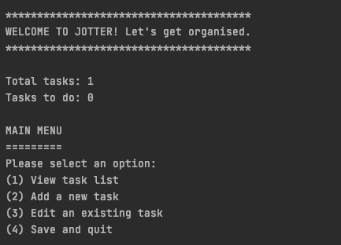
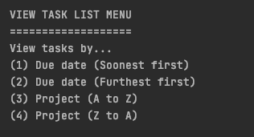
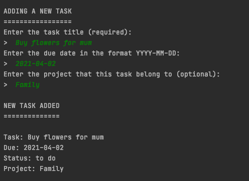
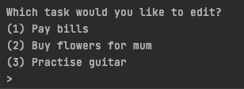
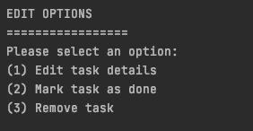

# Jotter: to do list app
Welcome to Jotter, a simple to do list app that you can run from the command line.

## Getting started
Jotter can be run directly via Gradle or via a generated jar file.

### Run with Gradle
In the root folder, start Jotter with the following command:
```bash
gradle run --console plain
```
### Run with jar file
First, generate the jar file with Gradle's build command.
```bash
gradle build
```
The jar file will be generated in `build/libs`. Run it using the command:
```bash
java -jar build/libs/to-do-list-app-1.0-SNAPSHOT.jar
```

## Using this app
This app helps you track the tasks you need to do.
It loads the task list from the previous session or creates a new one if there was a problem loading.
The welcome message gives an overview of total tasks and number of tasks done.
The main menu has 4 options. Make your selection by typing a number (1 to 4) and pressing enter.



### 1: View task list
You can choose to view the tasks by title or project (ascending or descending order).



### 2: Add a new task
Add a task by entering a title (required), a due date, and a project that it belongs to (optional).
Confirmation of the new task will be displayed.



### 3: Edit an existing task
First, choose which task you want to edit. (If you only have one existing task, it will skip this step.)



Then choose if you want to edit the task details, mark it as done or remove it completely.


### 4: Save and quit task list
Finally, you can save the current task list and quit. Your task list will be available the next time you run the app.

## Documentation
### Class diagram
The class diagram is available at the respository root: `jotterClassDiagram.png`

### Javadocs
You can view the javadocs for this project by navigating to `javadoc/index.html` from the repository root.

## Authors and acknowledgments
Thank you to the staff and teaching assistants of SDA for sharing their knowledge. Thanks also to David J Barnes and Michel Kölling, authors of 'Objects First with Java' for providing code inspiration.
