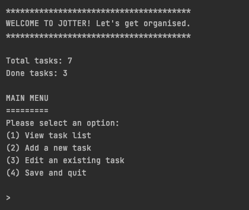

# Jotter: to do list app
Welcome to Jotter, a simple to do list app that you can run from the command line.

## Getting started
Jotter can be run directly via Gradle or via a generated jar file.

### Run with Gradle
In the root folder, start Jotter with the following command:
```bash
gradle run --console plain
```
### Run with jar file
First, generate the jar file with Gradle's build command.
```bash
gradle build
```
The jar file will be generated in `build/libs`. Run it using the command:
```bash
java -jar build/libs/to-do-list-app-1.0-SNAPSHOT.jar
```

## Using this app
This app helps you track the tasks you need to do. Here's how:



### View task list
View the task list - choose to view the tasks by title or project (ascending or descending order).


### Add tasks
Add tasks and give them a title, due date, and (optionally) a project that it belongs to.


### Edit tasks
You can edit tasks. 
First, choose which task you want to edit. 


Then choose whether to edit the task details, mark it as done or remove it completely.


### Save and quit task list
Save the current task list and restart the app with the task list restored.

## Authors and acknowledgments
Thank you to the staff and teaching assistants of SDA for sharing their knowledge. Thanks also to David J Barnes and Michel Kölling, authors of 'Objects First with Java' for providing code inspiration.
